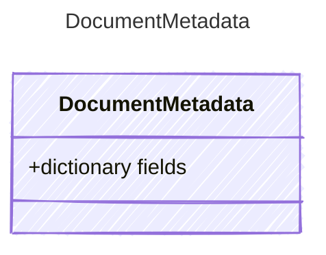

<!-- <auto-generated by typra-emitter> -->

User-defined key/value metadata stored with portable documents.

## Class Diagram

## Properties

| Name | Type | Description |
| ---- | ---- | ----------- |
| fields | dictionary |  |
