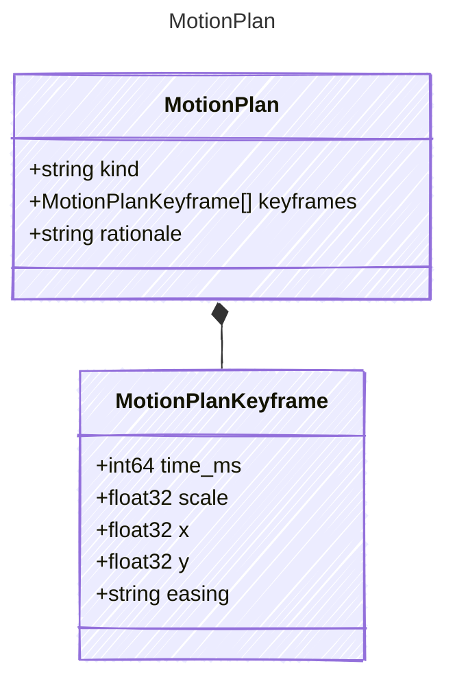

<!-- <auto-generated by typra-emitter> -->

Agent-generated camera motion plan for screenshot rows.

## Class Diagram

## Properties

| Name | Type | Description |
| ---- | ---- | ----------- |
| kind | string | `subtle_push`, `wide_hold_then_push`, or `push_then_drift`.
A string until Typra emits matching Rust enum variant names for
multi-word values in generated tests. |
| keyframes | [MotionPlanKeyframe[]](../motionplankeyframe/) |  |
| rationale | string |  |

## Composed Types

The following types are composed within `MotionPlan`:

- [MotionPlanKeyframe](../motionplankeyframe/)
