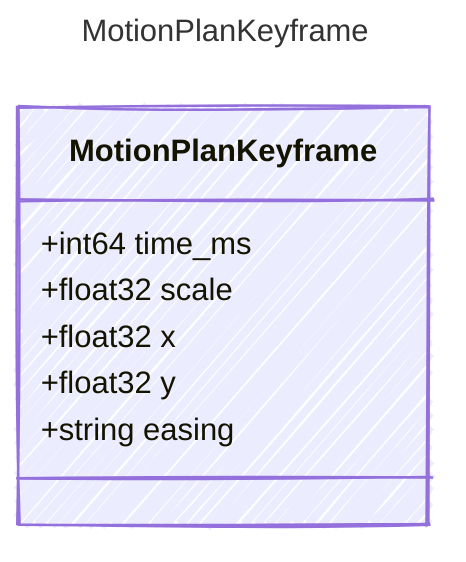

<!-- <auto-generated by typra-emitter> -->

## Class Diagram

## Properties

| Name | Type | Description |
| ---- | ---- | ----------- |
| time_ms | int64 |  |
| scale | float32 |  |
| x | float32 |  |
| y | float32 |  |
| easing | string |  |
