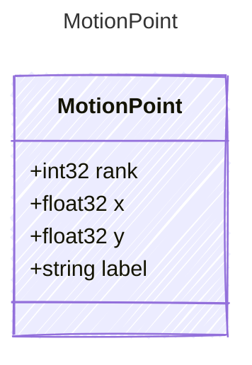

<!-- <auto-generated by typra-emitter> -->

Ranked normalized screenshot point used for camera moves.

## Class Diagram

## Properties

| Name | Type | Description |
| ---- | ---- | ----------- |
| rank | int32 | 1, 2, or 3. |
| x | float32 |  |
| y | float32 |  |
| label | string |  |
