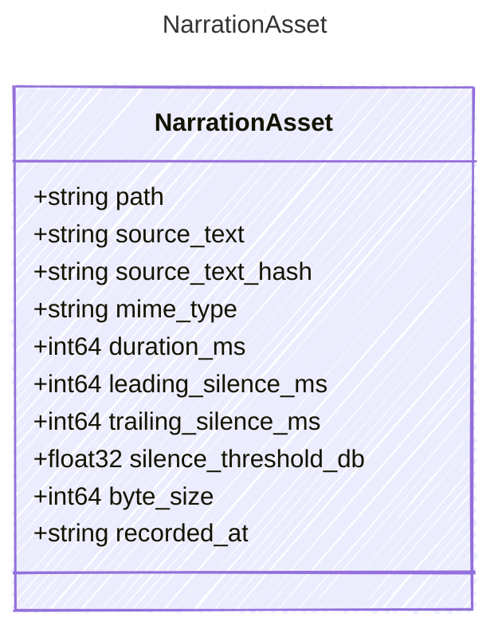

<!-- <auto-generated by typra-emitter> -->

Recorded or generated narration audio attached to a row.

## Class Diagram



## Yaml Example

```yaml
path: .cutready/narration/row-1.wav
```

## Properties

| Name | Type | Description |
| ---- | ---- | ----------- |
| path | string |  |
| source_text | string | Narrative text at the moment the audio was recorded or generated. |
| source_text_hash | string | SHA-256 of `source_text`. |
| mime_type | string |  |
| duration_ms | int64 | Canonical save writes `null` when unknown. |
| leading_silence_ms | int64 |  |
| trailing_silence_ms | int64 |  |
| silence_threshold_db | float32 |  |
| byte_size | int64 |  |
| recorded_at | string | RFC 3339 UTC timestamp. |
