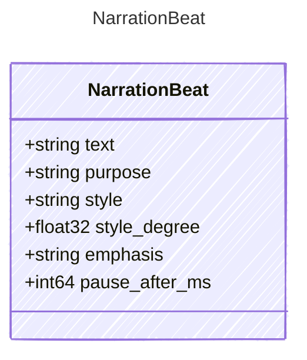

<!-- <auto-generated by typra-emitter> -->

A deliberate delivery beat for generated narration.

## Class Diagram

## Properties

| Name | Type | Description |
| ---- | ---- | ----------- |
| text | string |  |
| purpose | string |  |
| style | string |  |
| style_degree | float32 |  |
| emphasis | string |  |
| pause_after_ms | int64 |  |
