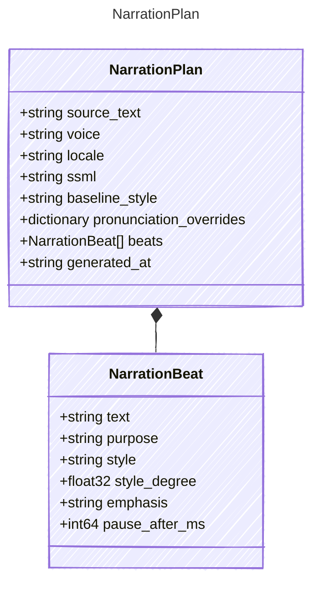

<!-- <auto-generated by typra-emitter> -->

Durable creative direction and compiled SSML for generated narration.

## Class Diagram

## Properties

| Name | Type | Description |
| ---- | ---- | ----------- |
| source_text | string |  |
| voice | string |  |
| locale | string |  |
| ssml | string |  |
| baseline_style | string |  |
| pronunciation_overrides | dictionary |  |
| beats | [NarrationBeat[]](../narrationbeat/) |  |
| generated_at | string | RFC 3339 UTC timestamp. |

## Composed Types

The following types are composed within `NarrationPlan`:

- [NarrationBeat](../narrationbeat/)
