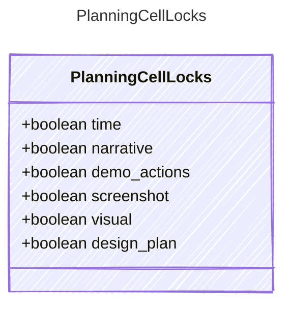

<!-- <auto-generated by typra-emitter> -->

Per-cell lock state. Canonical save writes all six fields.

## Class Diagram

## Properties

| Name | Type | Description |
| ---- | ---- | ----------- |
| time | boolean |  |
| narrative | boolean |  |
| demo_actions | boolean |  |
| screenshot | boolean |  |
| visual | boolean |  |
| design_plan | boolean |  |
