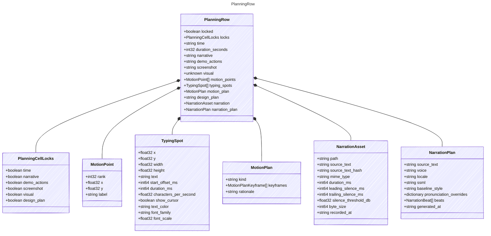

<!-- <auto-generated by typra-emitter> -->

A row in the sketch planning table.
Unknown fields must survive every runtime's decode -> save.

## Class Diagram



## Yaml Example

```yaml
time: 0:20
narrative: Welcome to CutReady.
demo_actions: Open the workspace.
```

## Properties

| Name | Type | Description |
| ---- | ---- | ----------- |
| locked | boolean | Whether the entire row is protected from edits. Saved as `false` when unset. |
| locks | [PlanningCellLocks](../planningcelllocks/) | Saved with all six fields, even when nothing is locked. |
| time | string | Human duration such as `~30s`, `0:20`, or `2m`. |
| duration_seconds | int32 | Concrete duration in seconds. |
| narrative | string |  |
| demo_actions | string |  |
| screenshot | string | Project-relative screenshot path. Canonical save writes `null` when absent. |
| visual | unknown | Project-relative Elucim visual path (legacy files may inline the document). Opaque. |
| motion_points | [MotionPoint[]](../motionpoint/) |  |
| typing_spots | [TypingSpot[]](../typingspot/) |  |
| motion_plan | [MotionPlan](../motionplan/) |  |
| design_plan | string | Designer brief for the visual. |
| narration | [NarrationAsset](../narrationasset/) |  |
| narration_plan | [NarrationPlan](../narrationplan/) |  |

## Composed Types

The following types are composed within `PlanningRow`:

- [PlanningCellLocks](../planningcelllocks/)
- [MotionPoint](../motionpoint/)
- [TypingSpot](../typingspot/)
- [MotionPlan](../motionplan/)
- [NarrationAsset](../narrationasset/)
- [NarrationPlan](../narrationplan/)
