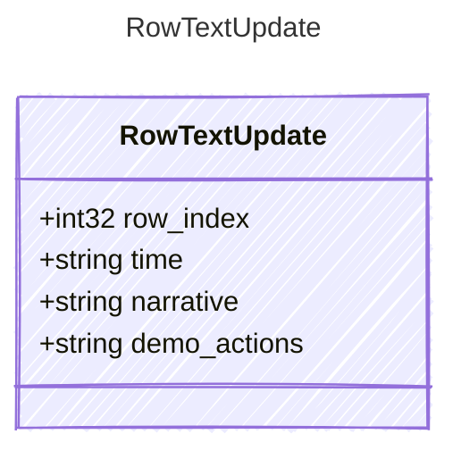

<!-- <auto-generated by typra-emitter> -->

Text cells to replace on one planning row. Omitted cells are left untouched.
Desktop's time-cell UI also recomputes `duration_seconds`; this edit does not
(see contracts/README.md, "Open policy questions").

## Class Diagram

## Properties

| Name | Type | Description |
| ---- | ---- | ----------- |
| row_index | int32 | Zero-based, non-negative row index. |
| time | string |  |
| narrative | string |  |
| demo_actions | string |  |
