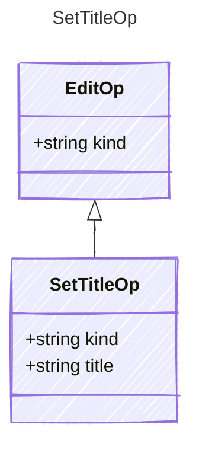

<!-- <auto-generated by typra-emitter> -->

## Class Diagram

```mermaid
---
title: SetTitleOp
config:
  look: handDrawn
  theme: colorful
  class:
    hideEmptyMembersBox: true
---
classDiagram
    class EditOp {
        +string kind
    }
    EditOp <|-- SetTitleOp
    class SetTitleOp {
        +string kind
        +string title
    }
```

## Properties

| Name | Type | Description |
| ---- | ---- | ----------- |
| kind | string |  |
| title | string |  |
