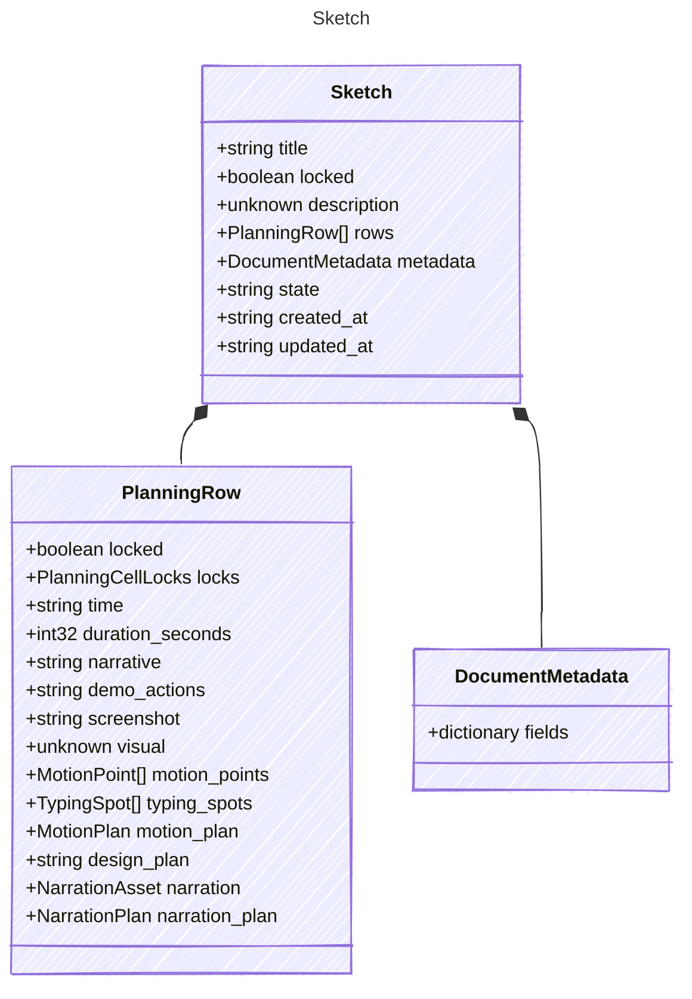

<!-- <auto-generated by typra-emitter> -->

A `.sk` file: a focused scene with a planning table.
Unknown top-level fields must survive every runtime's decode -> save.

## Class Diagram



## Yaml Example

```yaml
title: Intro
created_at: 2026-06-28T20:00:00Z
updated_at: 2026-06-28T20:20:00Z
```

## Properties

| Name | Type | Description |
| ---- | ---- | ----------- |
| title | string |  |
| locked | boolean | Whether the whole sketch is protected from edits. Saved as `false` when unset. |
| description | unknown | Rich-text description (Lexical JSON, Markdown string, or null). Opaque. |
| rows | [PlanningRow[]](../planningrow/) |  |
| metadata | [DocumentMetadata](../documentmetadata/) |  |
| state | string |  |
| created_at | string | RFC 3339 UTC timestamp. Runtimes never rewrite a timestamp they did not change. |
| updated_at | string | RFC 3339 UTC timestamp, set by every successful edit. |

## Composed Types

The following types are composed within `Sketch`:

- [PlanningRow](../planningrow/)
- [DocumentMetadata](../documentmetadata/)
