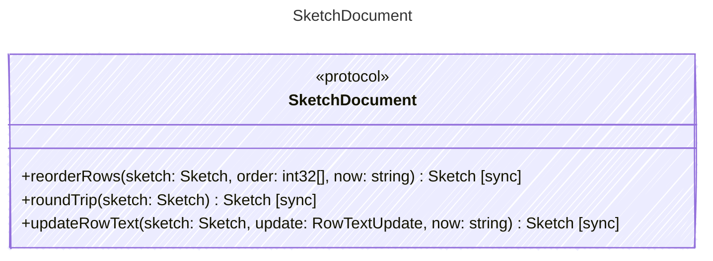

<!-- <auto-generated by typra-emitter> -->

Behavioral contract for `.sk` documents. Each runtime binds these operations
to its production decode, edit, and save code through a thin vector adapter.
Inputs and outputs are raw `.sk` JSON, so the vectors also prove that fields
a runtime does not model survive the round trip.
Successful edits set `updated_at` to `now`; rejected edits report a SketchEditError.

## Class Diagram

## Helper Methods

The following helper methods are declared via `@method` and must be implemented by every runtime. The schema declares the logical protocol contract; each runtime maps async-capable methods to idiomatic sync/async shapes for that language.

| Name | Signature | Runtime shape | Description |
| ---- | --------- | ------------- | ----------- |
| `reorderRows` | `reorderRows(sketch: Sketch, order: int32[], now: string) -> Sketch` | sync | Reorder rows. `order[i]` is the current zero-based index of the row that
moves to position `i`. |
| `roundTrip` | `roundTrip(sketch: Sketch) -> Sketch` | sync | Decode a `.sk` document and save it again without changes. |
| `updateRowText` | `updateRowText(sketch: Sketch, update: RowTextUpdate, now: string) -> Sketch` | sync | Replace text cells on one row. |
