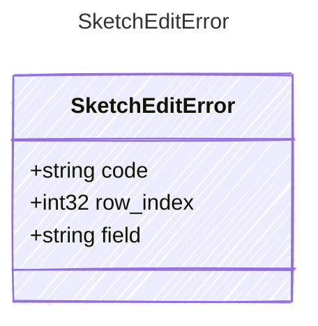

<!-- <auto-generated by typra-emitter> -->

The error payload every runtime reports when it rejects an edit.

## Class Diagram

## Properties

| Name | Type | Description |
| ---- | ---- | ----------- |
| code | string |  |
| row_index | int32 | Zero-based row position, for row-scoped errors. |
| field | string | The locked cell, for `locked_cell`. |
