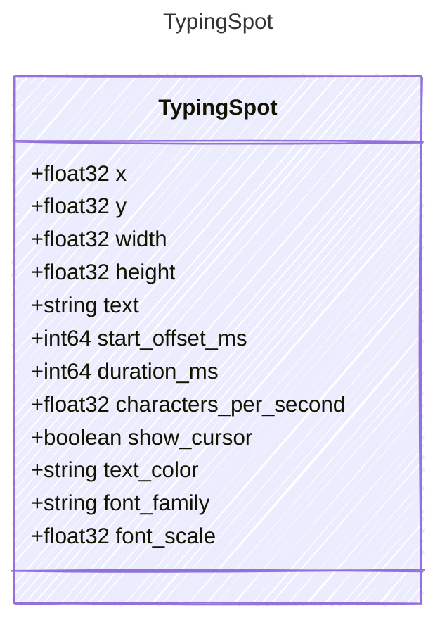

<!-- <auto-generated by typra-emitter> -->

A normalized text region rendered as a typewriter overlay.

## Class Diagram

## Properties

| Name | Type | Description |
| ---- | ---- | ----------- |
| x | float32 |  |
| y | float32 |  |
| width | float32 |  |
| height | float32 |  |
| text | string |  |
| start_offset_ms | int64 |  |
| duration_ms | int64 |  |
| characters_per_second | float32 |  |
| show_cursor | boolean |  |
| text_color | string |  |
| font_family | string |  |
| font_scale | float32 |  |
